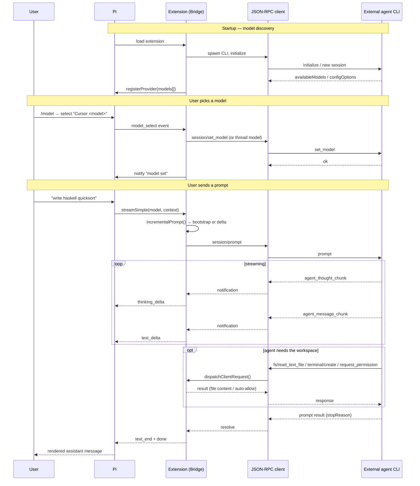
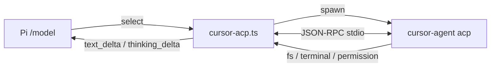
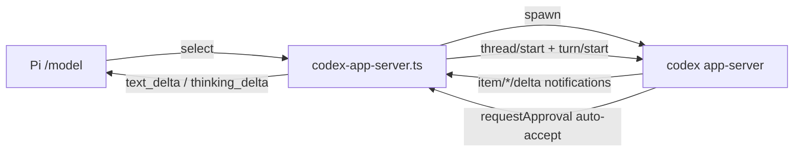
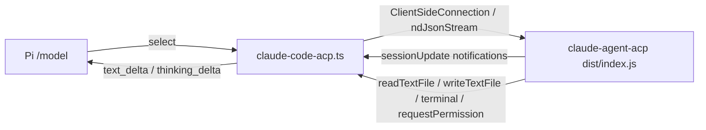
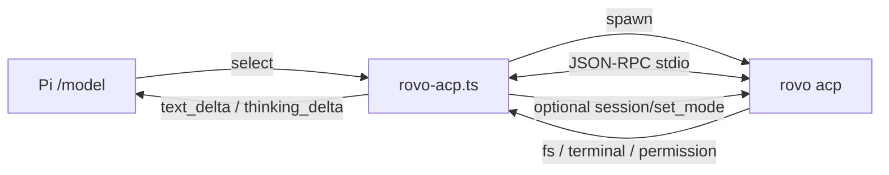

# How the Pi Agent Extensions Work

This directory contains four Pi extensions. Each one **bridges Pi to an external
coding agent** so that the external agent's models show up in Pi's `/model`
picker. When you select one of those models and send a prompt, Pi routes the
conversation out to the external agent (Cursor, Codex, Claude Code, or Rovo Dev),
streams the agent's reply back, and renders it as a normal assistant message.

| Extension | Bridges to | Underlying CLI | Transport | Protocol |
|-----------|-----------|----------------|-----------|----------|
| `cursor-acp.ts` | Cursor Agent | `cursor-agent acp` | stdio (NDJSON) | ACP, hand-rolled JSON-RPC |
| `codex-app-server.ts` | OpenAI Codex | `codex app-server` | stdio (NDJSON) | Codex app-server JSON-RPC |
| `claude-code-acp.ts` | Claude Code | `@agentclientprotocol/claude-agent-acp` | stdio (NDJSON) | ACP via official SDK |
| `rovo-acp.ts` | Atlassian Rovo Dev | `rovo acp` | stdio (NDJSON) | ACP, hand-rolled JSON-RPC |

All four follow the **same shape**. Understand one and you understand all of them.

---

## 1. The shared architecture

Every extension is a **provider bridge**. The moving parts are identical across
files (only the spawned command and a few protocol details differ):

```
┌──────────────────────────────────────────────────────────────────────┐
│                                Pi (host)                               │
│                                                                        │
│   /model picker ──select──▶ model_select event                         │
│   user prompt   ──────────▶ streamSimple(model, context, options)      │
│                                                                        │
│   ┌────────────────────────  Extension  ───────────────────────────┐  │
│   │                                                                 │  │
│   │  registerProvider(...)   ← models discovered at startup         │  │
│   │  Bridge (singleton)      ← owns one external session/thread     │  │
│   │   • runExclusive() queue ← serializes prompts                   │  │
│   │   • sentMessageCount     ← tracks what's already been sent      │  │
│   │  AcpProcess / *Server    ← JSON-RPC client over child stdio     │  │
│   └─────────────────────────────────┬───────────────────────────────┘  │
└─────────────────────────────────────┼──────────────────────────────────┘
                                       │ spawn() + stdin/stdout (NDJSON)
                                       ▼
                        ┌──────────────────────────────┐
                        │   External agent process     │
                        │  cursor-agent / codex /       │
                        │  claude-agent-acp / rovo      │
                        │                               │
                        │  runs its own tools, reads/   │
                        │  writes files, executes       │
                        │  terminal commands in cwd     │
                        └──────────────────────────────┘
```

### Key building blocks (same names in every file)

- **`registerProvider(PROVIDER, { ... })`** — registers a Pi provider whose
  `models` array makes each external model selectable in `/model`. The provider's
  `streamSimple` callback is what Pi calls to run a turn.
- **`AcpProcess` / `CodexAppServer` / `ClaudeAcpProcess`** — a JSON-RPC client
  that spawns the external CLI as a child process and talks newline-delimited
  JSON over its stdin/stdout. Handles request/response correlation, notifications,
  and **server-initiated requests** (the agent calling *back* into Pi).
- **The `*Bridge` singleton** — owns the long-lived external session/thread,
  binds it to the current Pi session + working directory, and serializes turns
  via `runExclusive()` (a promise chain) so two prompts never overlap.
- **`streamCursorProvider` / `streamCodexProvider` / …** — translates the
  external agent's streaming events into Pi's assistant-message event stream
  (`start` → `text_start`/`text_delta`/`thinking_*` → `text_end` → `done`).

### The agent calls back into Pi

A crucial detail: the bridge is a **client** of the external agent, but the agent
is also a client of Pi. When the agent wants to read a file, write a file, run a
terminal command, or ask for permission, it sends a JSON-RPC **request** *to the
extension*, which the extension fulfills using Node's `fs` and `child_process`.
This is why selecting one of these models lets the external agent actually work in
your repository.

Handled callbacks (ACP extensions): `fs/read_text_file`, `fs/write_text_file`,
`session/request_permission`, and a full terminal lifecycle
(`terminal/create`, `terminal/output`, `terminal/wait_for_exit`, `terminal/kill`,
`terminal/release`). Codex handles `item/commandExecution/requestApproval`,
`item/fileChange/requestApproval`, and `tool/requestUserInput`.

Permissions are **auto-allowed by default** (`*_AUTO_ALLOW != "false"`), and Codex
auto-accepts approvals — so the agent can edit the workspace without prompting.

### Context bridging (`bootstrapPrompt` / `incrementalPrompt`)

The external agent keeps its own conversation history, so the extension only sends
**new** messages. `sentMessageCount` tracks how many of Pi's messages have already
been forwarded:

- **First turn** → `bootstrapPrompt`: Pi system prompt + a "bridge note" telling
  the agent it's being driven by Pi + the full conversation rendered as text.
- **Later turns** → `incrementalPrompt`: only the message delta since last time.
- On **compaction** (`session_compact`), the external session is reset and the
  next turn re-bootstraps the full context.

---

## 2. Lifecycle events

Every extension subscribes to the same Pi events:

| Pi event | What the extension does |
|----------|------------------------|
| `session_start` | Captures `boundPiSessionKey` + `boundCwd` to bind the external session to this Pi session and directory. |
| `model_select` | (cursor / claude-code / rovo) Eagerly applies the chosen model to the live session via `set_model` / config option, and notifies the user. |
| `session_compact` | Resets the external session/thread so the next prompt re-sends full context. |
| `session_shutdown` | Disposes the bridge: kills the child process and any spawned terminals. |

Each also registers two slash commands: a **status** command and a **reset**
command (e.g. `cursor-acp-status` / `cursor-acp-reset`).

---

## 3. Sequence: selecting a model and sending a prompt

This sequence is essentially identical for all four extensions (Codex applies the
model at `thread/start` instead of via a separate `model_select`).



---

## 4. Per-extension notes

### `cursor-acp.ts` — Cursor Agent over ACP

- Spawns `cursor-agent acp` (override with `CURSOR_ACP_COMMAND` / `CURSOR_ACP_ARGS`).
- Hand-rolled ACP JSON-RPC client (`AcpProcess`).
- Models discovered from `session/new` → `models.availableModels`. If the agent
  advertises none, a synthetic `default[]` ("Auto") model is registered and
  `set_model` is skipped (the agent picks its own model).
- Streams `agent_message_chunk` → text and `agent_thought_chunk` → thinking via
  `session/update` notifications.
- Commands: `cursor-acp-status`, `cursor-acp-reset`.



### `codex-app-server.ts` — OpenAI Codex app-server

- Spawns `codex app-server` (override binary with `CODEX_BIN`).
- Uses Codex's **app-server JSON-RPC** (not ACP). Conversations are **threads**
  (`thread/start`, `turn/start`, `turn/interrupt`) rather than ACP sessions.
- The model is chosen when the **thread starts** (`thread/start { model }`), so
  there is **no `model_select` handler** — pick the model before your first prompt
  in a session, or use `codex-reset` to start a fresh thread.
- Configurable **approval policy** (`CODEX_APPSERVER_APPROVAL`, default
  `on-request`, auto-accepted) and **sandbox** (`CODEX_APPSERVER_SANDBOX`, default
  `workspace-write`).
- Models discovered via `model/list`. If none are found, the provider is **not
  registered**.
- Streams `item/agentMessage/delta` → text and `item/reasoning/summaryTextDelta`
  → thinking; surfaces command executions and file edits inline.
- Commands: `codex-status`, `codex-reset`.



### `claude-code-acp.ts` — Claude Code over ACP (official SDK)

- The only extension that uses the **official ACP SDK**
  (`@agentclientprotocol/sdk` + `@agentclientprotocol/claude-agent-acp`), which is
  why `npm install` is required (see `README.md`).
- By default it runs the package's `dist/index.js` with `process.execPath` (Node);
  override with `CLAUDE_CODE_ACP_COMMAND` / `CLAUDE_CODE_ACP_ARGS`.
- Implements the SDK's `Client` interface (`ClaudeAcpClient`) for file/terminal/
  permission callbacks, and connects with `ClientSideConnection` + `ndJsonStream`.
- Models come from the session's `configOptions` (the `model` select option); the
  model is applied via `setSessionConfigOption("model", id)`. Falls back to
  `opus` / `sonnet` / `haiku` aliases if discovery yields nothing.
- Reset closes the old session (`closeSession`) before opening a new one.
- Commands: `claude-code-acp-status`, `claude-code-acp-reset`.



### `rovo-acp.ts` — Atlassian Rovo Dev over ACP

- Nearly identical to `cursor-acp.ts` (hand-rolled ACP `AcpProcess`), spawning
  `rovo acp` (override with `ROVO_ACP_COMMAND` / `ROVO_ACP_ARGS`).
- Adds an optional **session mode** (`ROVO_ACP_MODE` = `default` | `ask` | `YOLO`)
  applied via `session/set_mode` when the session is created.
- Slightly more robust startup error handling: surfaces `failed to start rovo acp
  command …` if the `rovo` binary is missing, and includes `error.data.details`
  in rejected requests.
- Models discovered like Cursor; synthetic `default[]` fallback if none advertised.
- Reasoning heuristic also matches `opus` / `gpt-5` / `gemini` model ids.
- Commands: `rovo-acp-status`, `rovo-acp-reset` (status also shows current mode).



---

## 5. Why all four look the same

`cursor-acp.ts` is the reference implementation. `rovo-acp.ts` is a near-copy for a
different ACP-speaking CLI. `codex-app-server.ts` is "modeled on the cursor-acp.ts
ACP bridge" but speaks Codex's own app-server protocol with threads/turns.
`claude-code-acp.ts` keeps the same bridge shape but delegates the wire protocol to
the official ACP SDK. The common ideas — provider registration, a session-bound
bridge, a serialized prompt queue, incremental context forwarding, and event
translation into Pi's stream — are shared by design.

See `USAGE_GUIDE.md` for step-by-step instructions on switching to each model.
